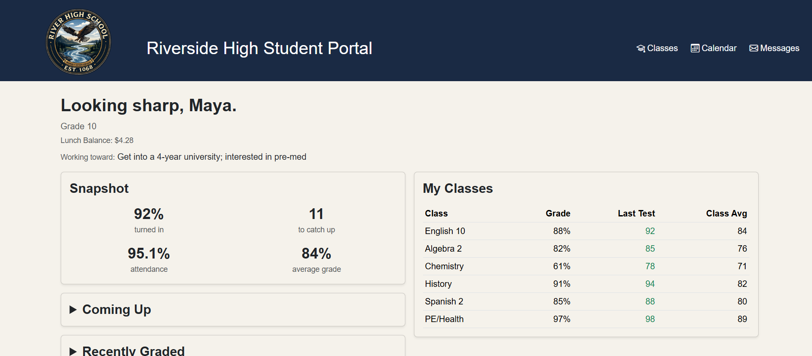

# Student Standing
Academic check in page using ASP.NET Core MVC and Bootstrap 5

# How to Run 
1. Clone or dowlnoad this repo
2. Open a terminal in the project folder
3. Run with dotnet run
4. Open url in browser
   

